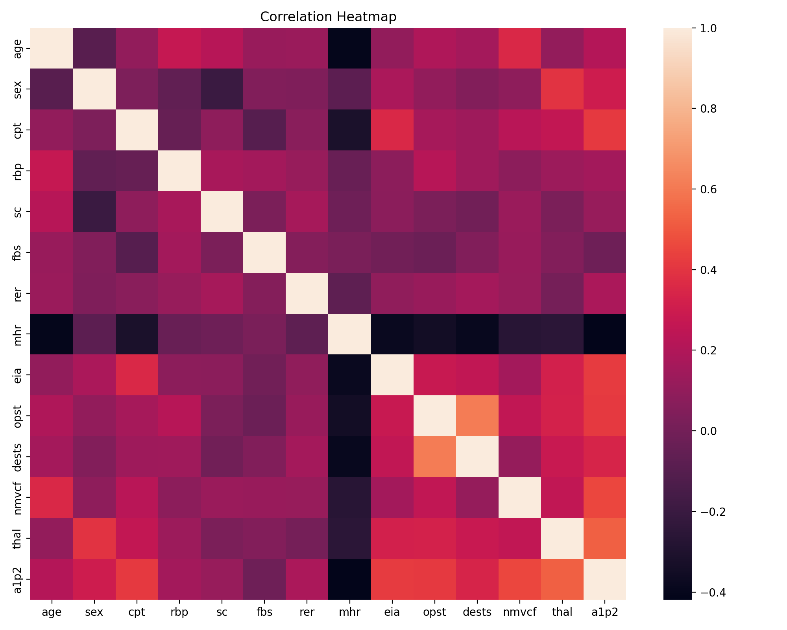
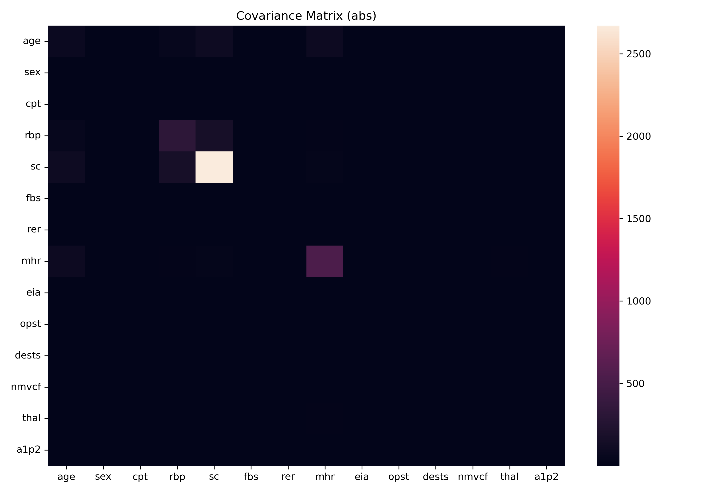
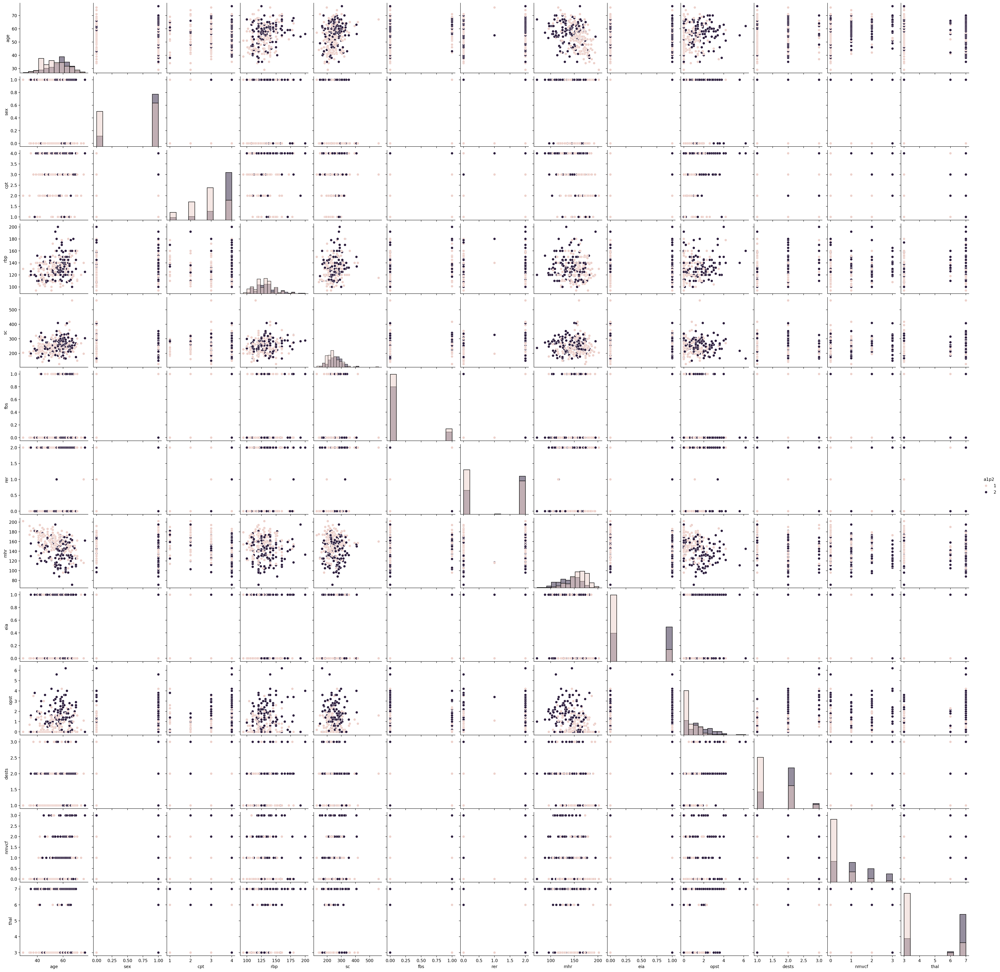

# Python for Rapid Engineering Solutions — EDA Evidence Archive

**Course context:** EEE 591 — Python for Rapid Engineering Solutions  
**Author:** Dossiya Dakou

This public repository currently documents an exploratory-data-analysis exercise built around `heart1.csv`, a submitted project report, and generated visual diagnostics.

The README is intentionally explicit about the difference between **artifacts that are actually committed** and **source code that is not yet complete in the public repository**.

## Current public evidence

| Artifact | What is present | Evidence status |
|---|---|---|
| [`heart1.csv`](heart1.csv) | analysis dataset | committed data artifact |
| [`Project1_Dossiya.pdf`](Project1_Dossiya.pdf) | course/project report | committed report |
| [`assets/correlation_heatmap.png`](assets/correlation_heatmap.png) | correlation visualization | generated output |
| [`assets/covariance_heatmap.png`](assets/covariance_heatmap.png) | covariance visualization | generated output |
| [`assets/pairplot.png`](assets/pairplot.png) | pairwise relationship visualization | generated output |
| [`Problem1_of_Project1.py`](Problem1_of_Project1.py) | placeholder example function | **not the analysis implementation** |

The final row is important: the current `Problem1_of_Project1.py` contains placeholder code. It must not be cited as the source that generated the EDA figures.

## Analytical objective

The exercise examines the dependence structure of the supplied numerical variables in order to identify:

- strong pairwise associations;
- potential redundancy / multicollinearity signals;
- covariance structure;
- visually unusual observations or nonlinear patterns;
- candidate variables for later predictive modeling.

The target variable referenced in the project is `a1p2`.

## Methodological workflow

```text
data inspection
→ missingness / types / summary statistics
→ covariance structure
→ correlation structure
→ pairwise visualization
→ interpretation
→ modeling implications
```

### Correlation

For numerical variables `X` and `Y`, the sample correlation is conceptually

```math
r_{XY}
=
\frac{\sum_i (x_i-\bar x)(y_i-\bar y)}
{\sqrt{\sum_i(x_i-\bar x)^2}\sqrt{\sum_i(y_i-\bar y)^2}}.
```

Correlation is used here as an **association diagnostic**, not evidence of causation.

### Covariance

```math
\operatorname{Cov}(X,Y)
=
\frac{1}{n-1}\sum_i(x_i-\bar x)(y_i-\bar y).
```

Because covariance depends on variable scale, covariance magnitude is not interpreted as a scale-free measure of association.

## Visual evidence

### Correlation heatmap



### Covariance heatmap



### Pair plot



## Interpretation discipline

The following claims are **not** justified by EDA alone:

- that a correlated variable causes the target;
- that the strongest pairwise correlation is the best predictive feature;
- that a model will generalize out of sample;
- that a biomedical association has clinical validity;
- that a visual pattern is statistically significant.

A defensible next modeling phase would require train/validation separation, preprocessing fit only on training data, explicit evaluation metrics, uncertainty estimates, and attention to data provenance and domain validity.

## Reproducibility status

### What can currently be reproduced from the repository

A reviewer can inspect:

- the data file;
- the submitted report;
- the three committed figures;
- repository history.

### What cannot yet be reproduced from committed source alone

The public repository does **not currently contain the complete analysis script/notebook that generated the three EDA figures**. Therefore the analysis is **artifact-verifiable but not yet source-reproducible**.

That limitation is recorded rather than hidden.

## Required closure before calling this fully reproducible

The repository should eventually include:

1. the exact analysis notebook/script;
2. a dependency file with pinned or bounded versions;
3. deterministic preprocessing steps;
4. a single command that regenerates all figures;
5. checks that expected columns exist;
6. a data-source/provenance note for `heart1.csv`;
7. generated-output checks or hashes where useful.

Until those items exist, this repository should be read as a **coursework evidence archive**, not a production analytical package.

## Engineering / data-science lessons demonstrated

The work supports evidence of experience with:

- structured tabular-data inspection;
- covariance and correlation analysis;
- multivariate visual diagnostics;
- interpretation of multicollinearity risk;
- distinction between exploratory association and causal inference;
- technical reporting of analytical outputs.

## Scientific-integrity rule

> A figure is evidence that an output exists. A figure is not, by itself, evidence that its generating code is reproducible or that its scientific interpretation is valid.

That distinction is maintained explicitly in this repository.

## License

See [`LICENSE`](LICENSE).

## Research portfolio

https://dossiya-se.github.io/
